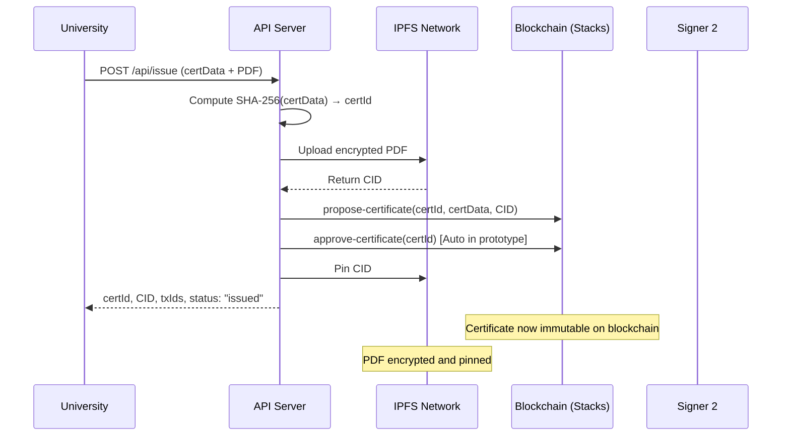

# Certivert - Blockchain Certificate Verification System

Certivert is a blockchain-based academic certificate verification system for Kenyan universities. It prevents fraudulent academic credentials by anchoring certificate records immutably on the Stacks blockchain (Bitcoin Layer 2) and storing encrypted documents on IPFS.

This project is in line with the strathmore school of computing and engineering sciences (sces) for the final year information systems project 2 of the course Bachelors Of Business Information Technology 2026

## 🏗️ Architecture

```
┌─────────────────┐   ┌─────────────────┐   ┌─────────────────┐
│   Frontend      │   │   Node.js API   │   │   Blockchain    │
│   (Phase 2)     │   │                 │   │                 │
│                 │   │  - REST API     │   │  - Clarity      │
│                 │   │  - SHA-256      │   │    Contracts    │
│                 │   │  - PDF Upload   │   │  - Stacks       │
│                 │   │  - IPFS Client  │   │    Network      │
└─────────────────┘   └─────────────────┘   └─────────────────┘
         │                       │                       │
         └───────────────────────┼───────────────────────┘
                                 │
                    ┌─────────────────┐
                    │      IPFS       │
                    │                 │
                    │  - Encrypted    │
                    │    PDFs         │
                    │  - Content      │
                    │    Addressing   │
                    └─────────────────┘
```

## 📁 Project Structure

```
certivert/
├── contracts/                        # Clarity smart contracts
│   ├── role-registry.clar            # Role management contract
│   └── certificate-store.clar        # Certificate lifecycle contract
├── tests/                            # Clarinet unit tests
│   ├── role-registry.test.ts
│   └── certificate-store.test.ts
├── api/                              # Node.js backend API
│   ├── src/
│   │   ├── index.js                  # Express app entry point
│   │   ├── config.js                 # Environment configuration
│   │   ├── routes/
│   │   │   ├── issue.js              # POST /api/issue
│   │   │   ├── verify.js             # GET /api/verify/:certId
│   │   │   └── revoke.js             # POST /api/revoke
│   │   ├── services/
│   │   │   ├── hash.js               # SHA-256 hashing utilities
│   │   │   ├── ipfs.js               # IPFS upload/fetch/pin
│   │   │   └── contract.js           # Stacks contract interaction
│   │   └── middleware/
│   │       ├── upload.js             # Multer PDF upload handler
│   │       └── errorHandler.js       # Global error handling
│   ├── package.json
│   └── .env.example
├── Clarinet.toml                     # Clarinet project config
└── README.md
```

## 🚀 Prerequisites

Before running Certivert, ensure you have:

1. **Clarinet CLI** - For smart contract development
   ```bash
   # Install via Homebrew (macOS)
   brew install clarinet
   
   # Or download from: https://github.com/hirosystems/clarinet
   ```

2. **Node.js 20+** - For the API backend
   ```bash
   # Install via Node Version Manager
   nvm install 20
   nvm use 20
   ```

3. **IPFS** - For document storage
   ```bash
   # Option 1: IPFS Desktop (Recommended for development)
   # Download from: https://docs.ipfs.tech/install/ipfs-desktop/
   
   # Option 2: Kubo CLI
   # Download from: https://docs.ipfs.tech/install/command-line/
   ```

## 🛠️ Setup

### 1. Clone and Initialize

```bash
git clone <repository-url>
cd certivert
```

### 2. Smart Contract Setup

```bash
# Install contract dependencies and check syntax
npm install
clarinet check

# Run contract unit tests
clarinet test
```

### 3. API Setup

```bash
# Navigate to API directory
cd api

# Install Node.js dependencies
npm install

# Copy environment configuration
cp .env.example .env

# Edit .env file if needed (defaults should work for development)
nano .env
```

### 4. Start Development Environment

```bash
# Terminal 1: Start Clarinet devnet (blockchain)
clarinet devnet start

# Terminal 2: Start IPFS (if not using IPFS Desktop)
ipfs daemon

# Terminal 3: Start API server
cd api
npm start
```

## 🎮 Usage

### 1. Set Up Roles (One-time setup)

Before issuing certificates, you need to assign roles using Clarinet console:

```bash
# In a new terminal (while devnet is running)
clarinet console

# Assign university role to deployer
(contract-call? .role-registry assign-role 'ST1PQHQKV0RJXZFY1DGX8MNSNYVE3VGZJSRTPGZGM "university")

# Assign KNQA role to wallet_2  
(contract-call? .role-registry assign-role 'ST2CY5V39NHDPWSXMW9QDT3HC3GD6Q6XX4CFRK9AG "knqa")

# Add authorized signer
(contract-call? .certificate-store add-authorised-signer 'ST2JHG361ZXG51QTKY2NQCVBPPRRE2KZB1HR05NNC)
```

### 2. API Endpoints

#### Issue Certificate
```bash
curl -X POST http://localhost:4000/api/issue \
  -F "studentName=John Doe" \
  -F "admissionNo=ADM001" \
  -F "programme=Computer Science" \
  -F "year=2023" \
  -F "grade=First Class" \
  -F "pdf=@certificate.pdf"
```

**Response:**
```json
{
  "certId": "a1b2c3d4e5f6789012345678901234567890abcdef1234567890abcdef123456",
  "ipfsCid": "QmYjtig7VJQ6XsnUjqqJvj7QaMcCAwtrgNdahSiFofrE7o",
  "proposeTxId": "0x1234...",
  "approveTxId": "0x5678...",
  "status": "issued"
}
```

#### Verify Certificate
```bash
curl http://localhost:4000/api/verify/a1b2c3d4e5f6789012345678901234567890abcdef1234567890abcdef123456
```

**Response:**
```json
{
  "status": "VALID",
  "certificate": {
    "studentName": "John Doe",
    "admissionNo": "ADM001",
    "programme": "Computer Science",
    "year": 2023,
    "grade": "First Class",
    "issuedBy": "ST1PQHQKV0RJXZFY1DGX8MNSNYVE3VGZJSRTPGZGM",
    "issuedAt": 143
  },
  "hashVerified": true
}
```

#### Revoke Certificate
```bash
curl -X POST http://localhost:4000/api/revoke \
  -H "Content-Type: application/json" \
  -d '{
    "certId": "a1b2c3d4e5f6789012345678901234567890abcdef123456",
    "callerRole": "university"
  }'
```

**Response:**
```json
{
  "certId": "a1b2c3d4e5f6789012345678901234567890abcdef123456",
  "txId": "0xabcd...",
  "status": "revoked"
}
```

#### Health Check
```bash
curl http://localhost:4000/health
```

## 🧪 Testing

### Smart Contract Tests
```bash
clarinet test
```

### Manual API Testing
1. Ensure devnet is running: `clarinet devnet start`
2. Ensure IPFS is running
3. Set up roles (see Usage section)
4. Use curl commands or Postman to test endpoints

### Validation Checklist
- [ ] `clarinet check` passes
- [ ] `clarinet test` passes (all unit tests green)
- [ ] `POST /api/issue` with PDF returns certId and status "issued"
- [ ] `GET /api/verify/:certId` returns status "VALID" for that certId
- [ ] `POST /api/revoke` returns status "revoked"
- [ ] `GET /api/verify/:certId` after revocation returns status "REVOKED"
- [ ] Non-existent certId returns status "NOT_FOUND"
- [ ] IPFS upload and fetch works (encrypt → pin → fetch → decrypt)
- [ ] SHA-256 hash is deterministic for same cert data

## 📊 Certificate Lifecycle



## 🔒 Security Features

- **Immutable Records**: Certificates stored on Bitcoin-secured Stacks blockchain
- **Encrypted Storage**: PDFs encrypted with AES-256-CBC before IPFS storage
- **Hash Verification**: SHA-256 integrity checking prevents tampering
- **Role-based Access**: Only universities and KNQA can issue/revoke certificates
- **Multi-signature**: 2-of-2 approval process for certificate issuance
- **Rate Limiting**: API protected against abuse (100 requests/15 minutes)

## ⚠️ Prototype Limitations

This Phase 1 implementation includes shortcuts for development:

1. **Auto-approval**: Single API call handles full 2-of-2 multi-sig (production will require separate approval)
2. **Role simulation**: API accepts `callerRole` parameter instead of wallet signature verification
3. **Devnet only**: Uses Clarinet devnet, not live Stacks testnet/mainnet
4. **Hardcoded keys**: Uses standard devnet private keys (safe for development only)

## 🚧 Phase 2 Roadmap

- [ ] React.js frontend with wallet integration
- [ ] Hiro/Leather wallet authentication
- [ ] QR code generation for certificates
- [ ] Role-specific dashboards
- [ ] Real multi-signature workflow

## 📝 Environment Variables

| Variable | Description | Default |
|----------|-------------|---------|
| `STACKS_NETWORK` | Stacks network (devnet/testnet/mainnet) | devnet |
| `STACKS_API_URL` | Stacks API endpoint | http://localhost:3999 |
| `CONTRACT_ADDRESS` | Deployed contract address | ST1PQHQKV0... |
| `IPFS_API_URL` | IPFS API endpoint | http://127.0.0.1:5001 |
| `API_PORT` | API server port | 4000 |
| `ENCRYPTION_KEY` | 32-byte hex key for PDF encryption | (see .env.example) |

## 🐛 Troubleshooting

### "IPFS service unavailable"
- Ensure IPFS is running: `ipfs daemon` or start IPFS Desktop
- Check IPFS API URL in `.env` matches your IPFS configuration

### "Blockchain service unavailable" 
- Ensure Clarinet devnet is running: `clarinet devnet start`
- Check Stacks API URL in `.env` (default: http://localhost:3999)

### "Not authorized to revoke certificate"
- Ensure proper roles are assigned (see Setup section)
- Use correct `callerRole` values: "university" or "knqa"

### Contract deployment issues
- Run `clarinet check` to verify contract syntax
- Restart devnet: `clarinet devnet start --clean`

## 📄 License

MIT License - see LICENSE file for details

## 🤝 Contributing

1. Fork the repository
2. Create a feature branch
3. Make your changes
4. Add tests if applicable
5. Submit a pull request

---

**Built with ❤️ for secure academic credential verification in Kenya**
