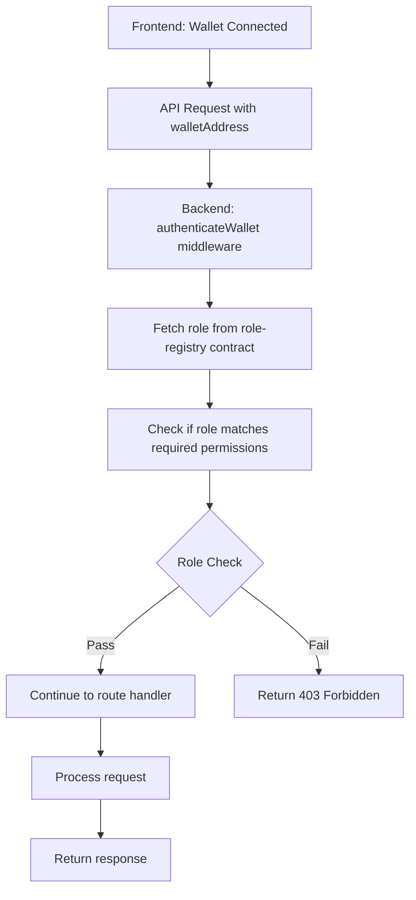

# Wallet-Based Authentication Guide

## Overview

The Certivert API now uses **Stacks Connect wallet integration** for authentication. This replaces header-based authentication with proper wallet connection and role verification from the blockchain.

## Frontend Integration (Stacks Connect)

### 1. Wallet Connection

Your frontend should use Stacks Connect to connect wallets like Leather or Xverse:

```javascript
import { showConnect, UserSession, AppConfig } from '@stacks/connect';

const appConfig = new AppConfig(['store_write', 'publish_data']);
const userSession = new UserSession({ appConfig });

// Connect wallet
const connectWallet = () => {
  showConnect({
    appDetails: {
      name: 'Certivert',
      icon: '/logo.png',
    },
    redirectTo: '/',
    onFinish: () => {
      window.location.reload();
    },
    userSession,
  });
};

// Get user address
const getUserAddress = () => {
  if (userSession.isUserSignedIn()) {
    const userData = userSession.loadUserData();
    return userData.profile.stxAddress.mainnet; // or testnet
  }
  return null;
};
```

### 2. API Requests with Wallet Data

When making API calls, include wallet information in the request body:

```javascript
// Certificate Issuance
const issueCertificate = async (certificateData, pdfFile) => {
  const walletAddress = getUserAddress();
  
  if (!walletAddress) {
    throw new Error('Wallet not connected');
  }

  const formData = new FormData();
  formData.append('walletAddress', walletAddress);
  formData.append('studentName', certificateData.studentName);
  formData.append('admissionNo', certificateData.admissionNo);
  formData.append('programme', certificateData.programme);
  formData.append('year', certificateData.year);
  formData.append('grade', certificateData.grade);
  formData.append('pdf', pdfFile);

  const response = await fetch('/api/issue', {
    method: 'POST',
    body: formData
  });

  return response.json();
};

// Certificate Revocation
const revokeCertificate = async (certId, reason) => {
  const walletAddress = getUserAddress();

  const response = await fetch('/api/revoke', {
    method: 'POST',
    headers: {
      'Content-Type': 'application/json',
    },
    body: JSON.stringify({
      walletAddress,
      certId,
      reason
    })
  });

  return response.json();
};
```

## API Endpoints

### POST /api/issue

**Purpose**: Issue a new certificate  
**Authentication**: Requires connected wallet with `university` role  

**Request Format**: `multipart/form-data`
```
walletAddress: string (required) - Connected wallet address
studentName: string (required)
admissionNo: string (required) 
programme: string (required)
year: number (required)
grade: string (required)
pdf: File (required) - Certificate PDF file
```

**Response** (Success - 200):
```json
{
  "certId": "270947212e82ef5f3b6dee0648199bfed3a7b8610c2d2cf586ce7bfb6694a944",
  "ipfsCid": "bafkreigszvu2yny3ktmadinotp6ypll6zs7edsc52tye22h4gbmmw7mo6u",
  "proposeTxId": "4d93157e4e0804702561be93752263c7823635f67b3c771f6acc3c0cec6eee85",
  "approveTxId": "ebcc3dbe2a33da3ac41bf6d41ce1fa52f40d091567e1e9b70f05f1e3917e1f91",
  "status": "issued",
  "message": "Certificate issued successfully"
}
```

**Response** (Authentication Error - 401):
```json
{
  "error": "Wallet address required",
  "code": "WALLET_ADDRESS_MISSING"
}
```

**Response** (Authorization Error - 403):
```json
{
  "error": "Access denied. Required roles: university. Your role: student. Connect with a wallet that has the required role.",
  "code": "INSUFFICIENT_ROLE"
}
```

### POST /api/revoke

**Purpose**: Revoke a certificate  
**Authentication**: Requires connected wallet with `university` or `knqa` role  

**Request Format**: `application/json`
```json
{
  "walletAddress": "ST1PQHQKV0RJXZFY1DGX8MNSNYVE3VGZJSRTPGZGM",
  "certId": "270947212e82ef5f3b6dee0648199bfed3a7b8610c2d2cf586ce7bfb6694a944",
  "reason": "Academic misconduct"
}
```

### GET /api/verify/:certId

**Purpose**: Verify a certificate  
**Authentication**: Public access (no wallet required)  

## Role System

User roles are stored on-chain in the `role-registry` contract and fetched automatically:

- **0 (none)**: No special permissions
- **1 (student)**: Can view own certificates  
- **2 (university)**: Can issue and revoke certificates
- **3 (knqa)**: Can revoke certificates and oversee system

## Authentication Flow



## Transaction Signing (Future Enhancement)

For operations requiring on-chain transactions, the frontend will need to sign transactions:

```javascript
import { openContractCall } from '@stacks/connect';

const signTransaction = async (contractCall) => {
  const options = {
    network: 'testnet', // or mainnet
    contractAddress: 'ST1PQHQKV0RJXZFY1DGX8MNSNYVE3VGZJSRTPGZGM',
    contractName: 'certificate-store',
    functionName: 'propose-certificate',
    functionArgs: [...], // Function arguments
    onFinish: (data) => {
      console.log('Transaction signed:', data.txId);
    },
  };

  await openContractCall(options);
};
```

## Error Handling

### Common Error Codes

- `WALLET_ADDRESS_MISSING`: No wallet address provided in request
- `WALLET_NOT_CONNECTED`: Wallet authentication failed
- `INSUFFICIENT_ROLE`: User role doesn't have permission for this operation
- `WALLET_REQUIRED`: Operation requires wallet connection for transaction signing

### Error Response Format

```json
{
  "error": "Human-readable error message",
  "code": "ERROR_CODE",
  "timestamp": "2025-04-15T10:30:00.000Z"
}
```

## Development Setup

### 1. Role Assignment

For development/testing, you need to assign roles to wallet addresses in your `role-registry` contract:

```clarity
;; Example: Assign university role to address
(contract-call? .role-registry set-user-role 'ST1UNIVERSITY... u2)
```

### 2. Frontend Configuration

Set up your frontend to connect to the appropriate Stacks network:

```javascript
const networkConfig = {
  development: 'http://localhost:3999',
  testnet: 'https://stacks-node-api.testnet.stacks.co',
  mainnet: 'https://stacks-node-api.mainnet.stacks.co'
};
```

## Migration from Header-Based Auth

### Old Format (deprecated):
```bash
curl -X POST /api/issue \
  -H "X-User-Role: university" \
  -H "X-User-Address: ST1..." \
  -F "studentName=John Doe" \
  ...
```

### New Format:
```bash
curl -X POST /api/issue \
  -F "walletAddress=ST1..." \
  -F "studentName=John Doe" \
  ...
```

## Security Considerations

1. **Role Verification**: Roles are fetched from blockchain, preventing role spoofing
2. **Wallet Ownership**: Only the owner of a wallet can use it for authentication  
3. **Transaction Signing**: Critical operations require on-chain signatures
4. **Network Security**: Use HTTPS in production
5. **CORS Configuration**: Restrict origins to your frontend domains

## Testing

Use the provided test wallet addresses for development:

```javascript
const testWallets = {
  university: 'ST1UNIVERSITY_ADDRESS',
  knqa: 'ST1KNQA_ADDRESS', 
  student: 'ST1STUDENT_ADDRESS'
};
```

Remember to assign appropriate roles to these addresses in your role-registry contract before testing.